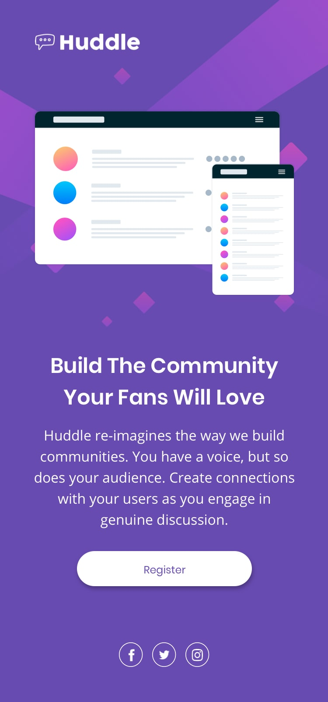

# 🌟 Huddle Landing Page

[](https://Fadi-Yaj.github.io/huddle-landing-page/)
[]()

---

## 📖 About The Project

> A modern, fully responsive landing page designed to showcase the Huddle brand. This project was built as a solution to the [Frontend Mentor challenge](https://www.frontendmentor.io?ref=challenge), focusing on clean design, accessibility, and a seamless user experience across all devices.

**Key Features:**

- ✅ Fully responsive layout (Mobile-first)
- ✅ Interactive info button with smooth toggle
- ✅ Social media links with hover effects
- ✅ Clean and maintainable CSS with custom properties
- ✅ Accessible and semantic HTML

---

## 🎨 Design Preview

| Mobile                                       | Desktop                                        |
| -------------------------------------------- | ---------------------------------------------- |
|  |  |

> _Note: Add screenshots to your `Assits/img/` folder for better presentation._

---

## 🛠️ Built With

- **HTML5** - Semantic markup
- **CSS3** - Custom properties, Flexbox, and responsive design
- **JavaScript** - DOM manipulation for interactive UI
- **Font Awesome** - Icons for social links and UI elements
- **Google Fonts** - Poppins & Open Sans

---

## 🚀 Getting Started

To run this project locally:

1. **Clone the repository**
   ```bash
   git clone https://github.com/your-username/huddle-landing-page.git
   ```

## 🎯 What I Learned

- Building a mobile-first responsive layout

- Using CSS custom properties for theming

- Creating interactive UI components with vanilla JavaScript

- Applying design tokens and maintaining a consistent design system

- Writing clean, semantic HTML and accessible code

## 👤 Programmer And Designer 

- **Fadi Yajouri**

GitHub: https://github.com/Fadi-Yaj

Frontend Mentor: https://www.frontendmentor.io/profile/Fadi-Yaj

- **Frontend Mentor**