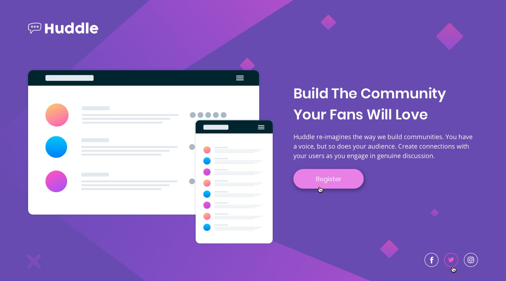

# 🏷️ Huddle Landing Page


🔗 **Watch the project live :** [Live Demo]( https://fadi-yaj.github.io/Huddle-landing-page/)

---

## 📖 Overview

This is my solution for the **Huddle Landing Page** challenge from [Frontend Mentor](https://www.frontendmentor.io/challenges).  
The goal was to build a clean, responsive landing page using **HTML**, **CSS**, and a touch of **JavaScript** for interactive elements.

The project focuses on creating an elegant, single-page layout with a modern design, beautiful typography, and a fully responsive structure that works seamlessly across all devices
---

## 🎨 Design Preview

| Mobile                                       | Desktop                                        | Active States                                  |
| -------------------------------------------- | ---------------------------------------------- | ---------------------------------------------- |
|  |  |    |

---

## 🛠️ Built With

- **HTML5** (Semantic markup)
- **CSS3** (Flexbox, CSS Variables, Media Queries)
- **JavaScript (ES6)** (DOM manipulation for the info toggle button)
- **Font Awesome** (for icons)
- **Google Fonts** (Poppins & Open Sans)

---

## ✨ Features

- **Clean Landing Page Layout**: Logo, hero image, title, description, CTA button, and social links.
- **Fully Responsive**: Optimized for mobile, tablet, and desktop using a mobile-first approach.
- **CSS Variables (`:root`)**: Consistent theming for colors, fonts, spacing, and breakpoints.
- **Interactive Info Button**: Click the gear icon to reveal designer and coder credits (built with JavaScript).
- **Elegant Typography**: Using Google Fonts (Poppins for headings, Open Sans for body text).
- **Smooth Hover Effects**: Interactive states for buttons, social icons, and the info button.

---

## 📱 Responsive Design

- Built with a **mobile-first** workflow.
- Breakpoints:
  - **Mobile:** Default (up to `375px`)
  - **Tablet:** `768px - 1023px`
  - **Desktop:** `1024px` and above

---

## 🚀 Installation

To run this project locally:

1. Clone the repository:

   ```bash
   git clone https://github.com/Fadi-Yaj/Huddle-landing-page.git
   ```

2. Navigate to the project folder

3. Open `index.html` directly in your browser (no server required).

---

## 💡 What I Practiced / Learned

- Structuring CSS with reusable variables for colors, fonts, and breakpoints.
- Building a fully responsive layout using CSS Flexbox and media queries.
- Implementing a mobile-first workflow to ensure a smooth experience on all devices.
- Adding interactivity with vanilla JavaScript (toggle button for info card).
- Using CSS pseudo-elements (::before / ::after) for decorative purposes
- Managing accessibility (keyboard support: Escape key to close the info card)

---

## 🔮 Possible Future Improvements

- Add smooth animations for the info card toggle.
- Implement a Dark Mode toggle using CSS variables.
- Add form validation for the "Register" button.
- Improve accessibility with ARIA attributes.

---

# 👨‍💻 Developer

Created by: **Mohammed Fadi Yajouri**

---

## 📬 For contact or inquiries, you can reach me via

- 📧**e-mail :** [fadiyaj99@gmail.com](mailto:fadiyaj99@gmail.com)
- 💼**LinkedIn :** [Mohammed Fadi Yajouri](https://www.linkedin.com/in/mohammed-yajouri-2156b0338/)
- 💬**WhatsApp :** [Contact me via WhatsApp](https://wa.me/963994742620)

---

## 🙏 Acknowledgments

- Challenge provided by [frontendmentor.io](https://www.frontendmentor.io/challenges)
- Design inspiration from the Huddle landing page challenge
